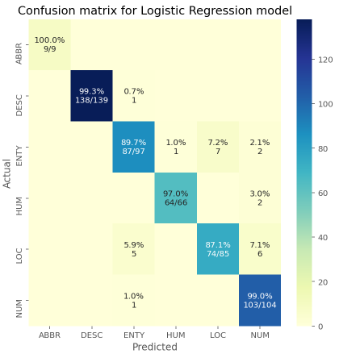

# AskMe
Ask Me is a question classification system. The questions have six different categories such as: Description(DESC), Entity(ENTY), Abbreviation(ABBR), Human(HUM), Location(LOC), Numeric Value(NUM). The objective is to detect the correct category that users ask.

# Strategy:
To investigate different approaches, the following data is used (downloaded from https://cogcomp.seas.upenn.edu/Data/QA/QC/):

Training set 5(5500 labeled questions)
Test set: TREC 10 questions

Different data analyses have been performed and four different models are trained. The models are the followings:

1. Tf-Idf + SVM: Tf-Idf is used for vectorizing texts and a linear model (i.e., SVM) is used for the classification. This approach combines stochastic gradient descent (SGD) learning with hinge loss (equivalent to a linear SVM) and l1 regularization (i.e., Lasso). This model achieves an accuracy of 93%.   

2. Doc2Vec + Logistic Regression: The vectorization is done using Doc2Vec (PV-DBOW: Distributed Bag of Words version of Paragraph Vector) by representing every question with 100d vectorized features. For the classification, logistic regression is used. It performed slightly better than the previous model (accuracy: 95%). 

3. GloVe + LSTM: GloVe word embedding is used to vectorize the texts. LSTM layer is added with a few dropout layers. The performance achieved is accuracy: 96%.

4. BERT: The transfer learning approach is followed by using pre-trained BERT-Large, Uncased(24-layer, 1024-hidden, 16-heads, 340M parameters). The hyperparameters are refined by following https://github.com/google-research/bert article. The google tokenizer (https://github.com/google-research/bert/blob/master/tokenization.py) is used for tokenizing the texts. Overall, the best performance is achieved from this model is accuracy: 99%.

# Performance

# How to Run:
Please check the Question_Classification.ipynb file for the detailed analysis. The file is also available and can directly be viewed in the following link:

https://colab.research.google.com/drive/1SqGSdFJYKjxgXkIQGrZDFHd1bFyoco0o?usp=sharing

This file requires other dependencies,which have be to under the same directory. The dependencies can be found in the following link:

https://drive.google.com/drive/folders/1Ra3pS_6zP4BKebKJ001Dlt34VFtqWgoV?usp=sharing

The dependencies are as follows:

> train5.csv (training data)

> test.csv (testing data)

> tokenization.py (tokenizer for the BERT model)

> glove.6B.100d.txt (Word embedding for the LSTM model)

> bert_en_uncased_L-24_H-1024_A-16_1.tar.gz (BERT layer)

